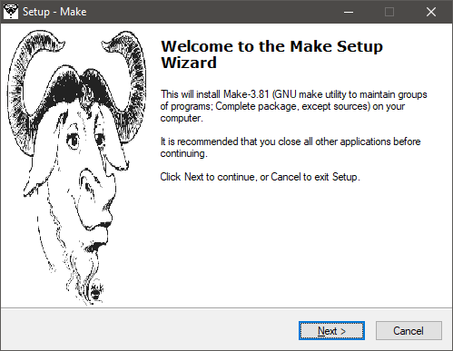
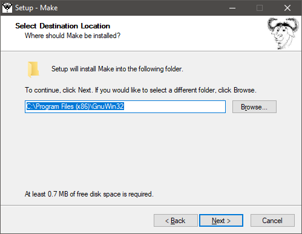
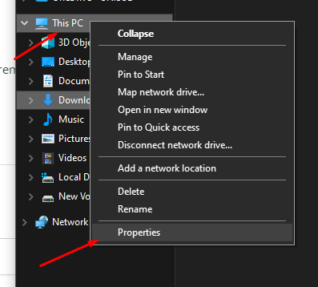
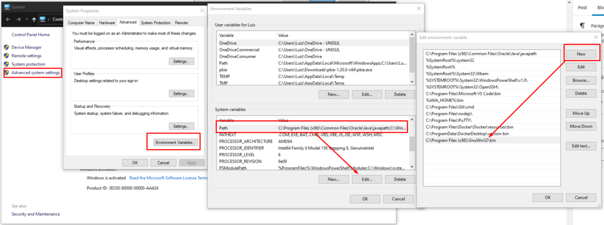

Usando comando Make no Windows

Nesse rápido tutorial iremos ver como instalar o “make” para utilizar o comando make no Windows, para que você possa automatizar tarefas utilizando o Makefile.

Instalação do Make
Primeiro passo você precisa realizar o download e instalação do Make. Para realizar o download, utilize o seguinte [link](http://gnuwin32.sourceforge.net/packages/make.htm).

Instalação do Make
Realize a instalação padrão do Make, prestando atenção somente no diretório onde será instalado o make, conforme a imagem a seguir. Iremos utilizar essa informação mais tarde.

Diretório de instalação
Após a instalação do Make, precisaremos configurar a variável de ambiente do make recém instalado, para que possamos utilizar o comando make de forma geral no windows.

Configurando path ambiente Make
Para configurar o path de execução do make, precisamos acessar as propriedades do computador, navegar até a variável de sistema “path” e adicionar uma nova variável, informando o caminho do binário de instalação do make. Conforme as imagens a seguir.

Propriedades Computador

Nova variável

Pronto! Agora você já pode utilizar o comando make no Windows, podendo utilizar Makefiles para automatizar suas rotinas.